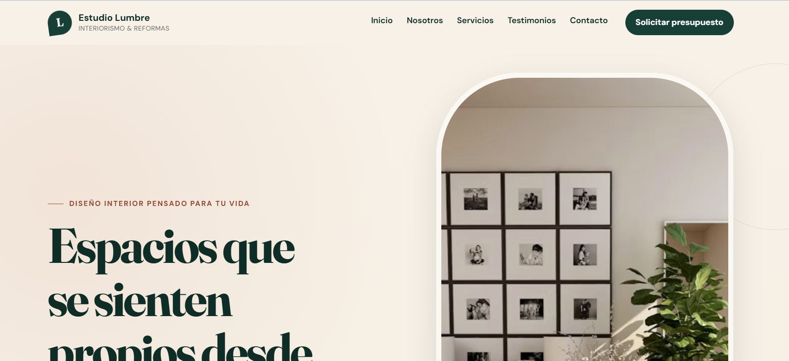
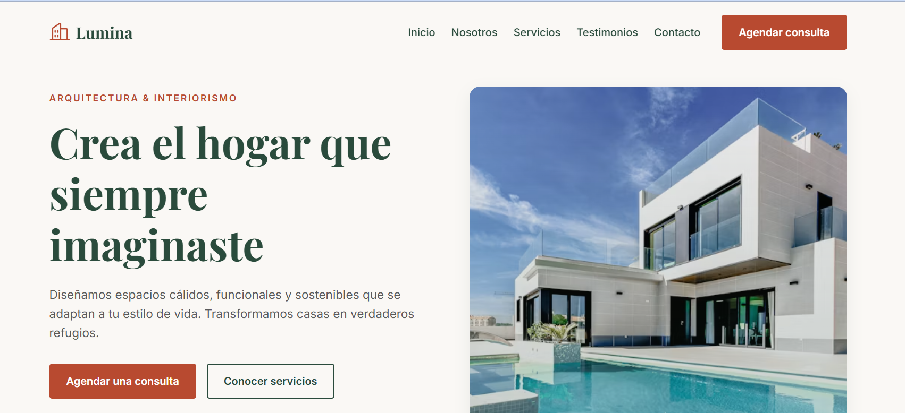

<div align="center">

<h1>&lt;PFO2&gt;</h1>

## Práctica Formativa Obligatoria 2 - Individual

### Prompt Engineering en Agentes de IA

</div>

---

## 📘 Descripción del proyecto

Este repositorio contiene la entrega individual correspondiente a la **Práctica Formativa Obligatoria 2** de la materia **Desarrollo de Sistemas Web (Front End)**.

El objetivo del trabajo es diseñar un **único prompt inicial de alta precisión** y utilizarlo en dos agentes de inteligencia artificial para generar dos landing pages de manera autónoma. A partir de los resultados obtenidos, el proyecto permite comparar cómo cada agente interpreta y resuelve una misma instrucción, especialmente en aspectos de estructura, diseño, accesibilidad, responsividad e interacciones del lado del cliente.

La entrega se integra en un **único despliegue** que comienza con una portada de acceso. Desde esa interfaz se puede consultar:

1. El texto plano del prompt utilizado.
2. La landing page generada por el primer agente.
3. La landing page generada por el segundo agente.

La solución fue desarrollada con **HTML5 semántico, CSS3 y JavaScript vanilla**, sin backend ni dependencias complejas.

---

## 👤 Datos del estudiante

| Dato | Información |
|---|---|
| **Nombres y apellidos** | Melissa Giselle Galeano Ibañez |
| **Materia** | Desarrollo de Sistemas Web (Front End) |
| **Comisión** | D |
| **Institución** | IFTS N.° 29 |
| **Año** | 2026 |

---

## 🚀 Deploy unificado

La portada y ambas landing pages se encuentran integradas en un único despliegue de Vercel:

> **URL del proyecto:** (https://pfo-2-front-end-prompt-engineering.vercel.app//)


---

## 🤖 Agentes y modelos utilizados

| Componente | Agente | Modelo de lenguaje |
|---|---|---|
| **Landing Page - Agente 1** | ChatGPT, de OpenAI | GPT-5.5 Thinking |
| **Landing Page - Agente 2** | Gemini | Gemini 1.5 Pro |

Ambos agentes recibieron el mismo prompt inicial para poder comparar sus resultados bajo condiciones equivalentes.

---

## 🧭 Estructura de acceso

La portada principal ofrece tres accesos directos:

- **Prompt utilizado:** abre el archivo de texto plano con la instrucción completa.
- **Landing Page - Agente 1:** dirige al primer sitio generado.
- **Landing Page - Agente 2:** dirige al segundo sitio generado.

---


## 🧩 Componentes del proyecto

### Portada

La página principal funciona como interfaz de acceso unificada. Presenta el título de la práctica, los datos de cada agente y tres enlaces principales: el prompt, la landing del Agente 1 y la landing del Agente 2.

### Landing Page - Agente 1

Primera solución generada a partir del prompt común. Se conserva dentro de la carpeta `chatgpt/`.


### Landing Page - Agente 2

Segunda solución generada a partir del mismo prompt. Se conserva dentro de la carpeta `gemini/`.


### Prompt en texto plano

El archivo `prompt.txt` contiene la instrucción completa y exacta enviada a los dos agentes.

---

## 📝 Prompt exacto utilizado

El siguiente bloque reproduce de forma íntegra el prompt utilizado para generar las landing pages.

<details>
<summary><strong>Ver prompt completo</strong></summary>

```text
Prompt para crear una landing page profesional

Rol
Actúa como un Ingeniero de Software Frontend Senior especializado en UX/UI, accesibilidad y diseño web responsive.
Tienes experiencia creando landing pages modernas, visualmente atractivas, orientadas a conversión y desarrolladas con código limpio, semántico y mantenible.

Objetivo
Diseña y desarrolla una landing page completa y funcional del lado del cliente para el siguiente negocio:
• Nombre: [NOMBRE DEL NEGOCIO]
• Rubro: [RUBRO O TIPO DE SERVICIO]
• Público objetivo: [DESCRIPCIÓN DEL PÚBLICO]
• Objetivo principal de la landing: [CAPTAR CONTACTOS / VENDER UN SERVICIO / CONSEGUIR RESERVAS / PRESENTAR UNA MARCA]
• CTA principal: [SOLICITAR PRESUPUESTO / AGENDAR UNA CONSULTA / COMENZAR AHORA]
• Idioma: Español

Si algún dato comercial no está definido, crea contenido ficticio pero realista, coherente y fácil de reemplazar. No utilices texto genérico como “Lorem ipsum”.

Dirección visual
Crea una estética editorial, cálida, elegante y contemporánea, claramente diferente de los diseños tecnológicos oscuros con colores neón.
Utiliza como referencia la siguiente dirección artística:
• Fondo principal en tonos marfil, blanco cálido o beige claro.
• Color primario verde bosque, azul petróleo o marrón oscuro.
• Color de acento terracota, coral apagado o mostaza.
• Textos en gris carbón para asegurar buena legibilidad.
• Tipografía con personalidad para los títulos y una tipografía sans serif limpia para los textos.
• Espacios amplios y una jerarquía visual clara.
• Bordes suaves, sombras discretas y elementos decorativos sutiles.
• Fotografías, ilustraciones o recursos visuales relacionados con el rubro.
• Evita efectos excesivos, brillos neón, fondos completamente negros y una apariencia genérica de plantilla.

La interfaz debe transmitir:
• Profesionalismo.
• Cercanía.
• Confianza.
• Claridad.
• Calidad del servicio.

Principios de UX/UI
• Prioriza la comprensión rápida de la propuesta de valor.
• El CTA principal debe ser visible sin necesidad de hacer scroll.
• Mantén una jerarquía clara entre títulos, subtítulos, texto y acciones.
• Utiliza textos breves, específicos y orientados a beneficios.
• Diseña cada sección con suficiente espacio visual.
• Evita bloques de texto demasiado extensos.
• Incluye estados hover, focus y active en los elementos interactivos.
• Mantén consistencia en colores, radios, espaciados, botones y tarjetas.
• No sacrifiques legibilidad por decoración.

Requisitos técnicos
Desarrolla la página utilizando:
• HTML5 semántico.
• CSS3 moderno.
• JavaScript vanilla únicamente cuando sea necesario.
• Flexbox y CSS Grid para la maquetación.
• Enfoque mobile-first.
• Código organizado, legible y comentado únicamente en las partes importantes.

La solución debe:
• Funcionar completamente del lado del cliente.
• No requerir backend.
• No depender de configuraciones complejas.
• Ser totalmente responsive.
• Adaptarse correctamente a celulares, tablets y computadoras.
• Evitar scroll horizontal en cualquier resolución.
• Mantener un buen rendimiento.
• Utilizar variables CSS para colores, tipografías, espacios y estilos reutilizables.
• Respetar las preferencias de reducción de movimiento mediante prefers-reduced-motion.

Puedes utilizar una fuente web de Google Fonts y una biblioteca ligera de iconos mediante CDN. No utilices frameworks de JavaScript ni dependencias innecesarias.

Accesibilidad
Aplica buenas prácticas de accesibilidad:
• Contraste suficiente entre fondo y texto.
• Estructura lógica de encabezados.
• Uso correcto de etiquetas semánticas.
• Textos alternativos en imágenes.
• Etiquetas visibles asociadas a los campos del formulario.
• Navegación completa mediante teclado.
• Indicadores de foco claramente visibles.
• Botones y enlaces con nombres accesibles.
• Áreas táctiles cómodas en dispositivos móviles.
• Atributos ARIA solamente cuando sean necesarios.

Estructura obligatoria
La landing page debe contener las siguientes secciones en este orden:

1. Cabecera
Incluye:
• Logotipo textual o isotipo sencillo.
• Nombre de la marca.
• Menú de navegación con enlaces internos.
• Enlaces a “Inicio”, “Nosotros”, “Servicios”, “Testimonios” y “Contacto”.
• Botón destacado con el CTA principal.
• Menú hamburguesa funcional en dispositivos móviles.
• Cabecera fija o sticky con un fondo legible al hacer scroll.

2. Hero Section
Incluye:
• Etiqueta o frase introductoria breve.
• Título principal impactante que comunique la propuesta de valor.
• Descripción de una o dos frases.
• Botón de CTA principal.
• Botón secundario para conocer los servicios o ver más información.
• Recurso visual relacionado con el negocio.
• Un pequeño elemento de confianza, como cantidad de clientes, años de experiencia o valoración promedio.

El título debe centrarse en el beneficio para el cliente y no limitarse a presentar el nombre de la empresa.

3. Sobre nosotros
Incluye:
• Título de sección.
• Descripción clara del negocio.
• Diferencial principal de la marca.
• Una imagen, composición visual o bloque destacado.
• Entre tres y cuatro datos relevantes, como experiencia, proyectos realizados, clientes o porcentaje de satisfacción.

Evita afirmaciones exageradas o poco creíbles.

4. Servicios o características principales
Crea entre tres y seis tarjetas.
Cada tarjeta debe incluir:
• Icono.
• Nombre del servicio.
• Descripción breve.
• Beneficio concreto.
• Enlace o acción secundaria como “Conocer más”.

Las tarjetas deben tener una distribución responsive y estados visuales al pasar el cursor o navegar con teclado.

5. Testimonios
Incluye al menos tres testimonios ficticios pero realistas.
Cada testimonio debe mostrar:
• Nombre del cliente.
• Cargo, empresa o tipo de cliente.
• Reseña breve.
• Valoración visual.
• Avatar o iniciales.
• Resultado o beneficio obtenido, cuando corresponda.

No utilices testimonios excesivamente genéricos. Deben parecer específicos y creíbles.

6. Formulario de contacto
Crea una sección visualmente destacada con:
• Título persuasivo.
• Texto introductorio.
• Campo de nombre.
• Campo de correo electrónico.
• Campo de teléfono opcional.
• Selector de servicio o motivo de consulta.
• Campo de mensaje.
• Casilla de aceptación de política de privacidad.
• Botón de envío.
• Información alternativa de contacto.

El formulario no requiere conexión con un backend.
Implementa únicamente validaciones básicas del lado del cliente y una confirmación visual simulada al enviarlo. No almacenes ni envíes información real.

7. Pie de página
Incluye:
• Nombre o logotipo de la marca.
• Descripción breve.
• Enlaces de navegación.
• Datos de contacto.
• Enlaces a redes sociales.
• Aviso de copyright con el año actual.
• Enlaces ficticios a política de privacidad y términos de uso.

Los enlaces a redes sociales deben tener iconos y etiquetas accesibles.

Interacciones
Implementa las siguientes interacciones de manera sutil:
• Desplazamiento suave hacia las secciones.
• Apertura y cierre del menú móvil.
• Cierre del menú móvil al seleccionar un enlace.
• Cambio visual de la cabecera al hacer scroll.
• Microinteracciones en botones, enlaces y tarjetas.
• Validación visual del formulario.
• Mensaje de envío exitoso simulado.
• Animaciones de aparición discretas, sin perjudicar el rendimiento ni la accesibilidad.

No agregues carruseles automáticos, ventanas emergentes intrusivas ni animaciones excesivas.

Contenido y copywriting
Redacta todos los textos de la página.
El contenido debe:
• Estar escrito en español natural.
• Ser claro, profesional y persuasivo.
• Enfatizar beneficios antes que características técnicas.
• Utilizar títulos específicos.
• Mantener un tono cercano y confiable.
• Evitar clichés como “llevamos tu negocio al siguiente nivel”, salvo que se reformulen de manera más concreta.
• Mantener coherencia con el rubro y público objetivo.
• Usar un CTA principal consistente en toda la página.

SEO básico
Incluye:
• Etiqueta <title> descriptiva.
• Meta description.
• Etiqueta viewport.
• Un único <h1>.
• Jerarquía correcta de encabezados.
• Contenido semántico.
• Textos alternativos descriptivos.
• Open Graph básico con valores fáciles de reemplazar.
• Nombres de clases y estructura comprensibles.

Formato de entrega
Entrega el resultado en tres archivos:
/index.html
/styles.css
/script.js

Presenta primero una breve explicación de la dirección visual elegida.
Después, muestra el contenido completo de cada archivo en bloques de código separados y correctamente identificados.
El código debe estar completo y listo para copiar y ejecutar. No omitas secciones con comentarios como:
<!-- Agregar contenido aquí -->

No entregues pseudocódigo, fragmentos incompletos ni explicaciones en lugar del código.

Validación final
Antes de responder, revisa internamente que:
1. Estén presentes las siete secciones obligatorias.
2. Todos los enlaces internos apunten a identificadores existentes.
3. El menú móvil funcione correctamente.
4. El formulario tenga etiquetas y validación visual.
5. El diseño sea responsive desde 320 px.
6. No exista scroll horizontal.
7. Los colores tengan contraste suficiente.
8. Los estados de foco sean visibles.
9. El CTA principal sea consistente.
10. HTML, CSS y JavaScript estén completos y conectados correctamente.
11. La estética no sea oscura, futurista ni basada en colores neón.
12. El resultado pueda ejecutarse abriendo directamente index.html.

Corrige cualquier incumplimiento antes de entregar la respuesta.
```

</details>

## 📸 Capturas y recorridos de las landing pages

### Landing Page — Agente 1
[](./capturas/landing-agente-1.mp4)

> Hacé clic sobre la imagen para reproducir el recorrido.


### Landing Page — Agente 2

[](./capturas/landing-agente-2.mp4)

> Hacé clic sobre la imagen para reproducir el recorrido.

<div align="center">

**IFTS N.° 29**  
**Desarrollo de Sistemas Web (Front End) - Comisión D**  
**Profesor: Luciano Martinez - 2026**

</div>
